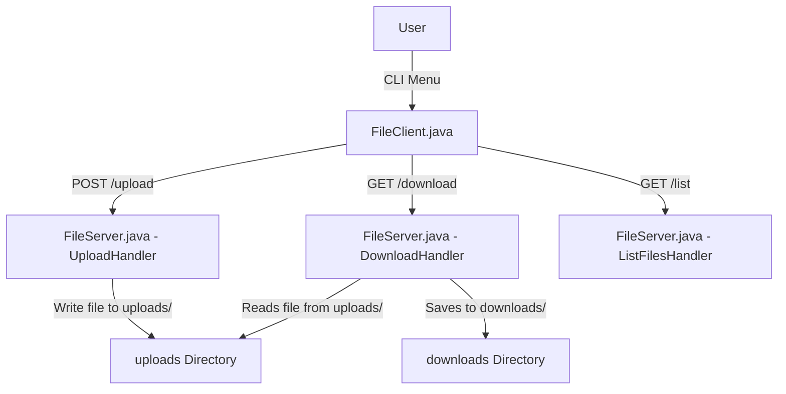

# Secure File Server and Client System

## Overview

This system is composed of two main components:

* **FileClient.java** – A Java-based CLI client that allows uploading, downloading, and listing files.
* **FileServer.java** – A multi-threaded Java HTTP server that handles file uploads, downloads, and listings securely.

---

## Features

### FileClient

* **Upload File**: Uploads a file to the server using HTTP POST with progress tracking.
* **Download File**: Downloads a file from the server using HTTP GET, stores uniquely, with progress tracking.
* **List Files**: Displays all available files on the server.
* **Duplicate File Prevention**: Uploads are checked via SHA-256 hash to prevent redundant copies.

### FileServer

* **Upload Handler**:

  * Accepts POST requests.
  * Rejects files larger than 20MB.
  * Detects and avoids duplicate uploads using SHA-256.
  * Auto-renames conflicting files.
* **Download Handler**:

  * Serves requested files.
  * Adds headers to enforce safe downloading.
* **List Files Handler**:

  * Lists all files in the `uploads/` directory with size.
* **Security Headers**:

  * `X-Content-Type-Options: nosniff`
  * `X-Frame-Options: DENY`
  * `X-XSS-Protection: 1; mode=block`

---

## Directory Structure

```
project/
├── FileClient.java
├── FileServer.java
├── uploads/           # Server-side file storage
├── downloads/         # Client-side download storage
```

---

## Diagram



---

## Security Considerations

* Input sanitization on filenames to prevent directory traversal.
* SHA-256 hash checking to avoid duplicate files.
* Limits upload size to prevent DoS attacks.
* Uses CORS and other HTTP headers to enhance browser safety (if integrated into a frontend).

---

## Limitations

* No user authentication implemented.
* Upload size is capped at 20MB.
* In-memory upload buffering can be inefficient for large files.

---

## Suggestions for Improvement

* Use streaming instead of buffering entire uploads in memory.
* Add authentication and authorization.
* Add file deletion support.
* Introduce RESTful JSON API responses.

---

## Conclusion

This Java-based file server and client system provides a secure, simple solution for file transfer operations over HTTP. It includes progress tracking, duplicate prevention, and security headers for safer data handling.
